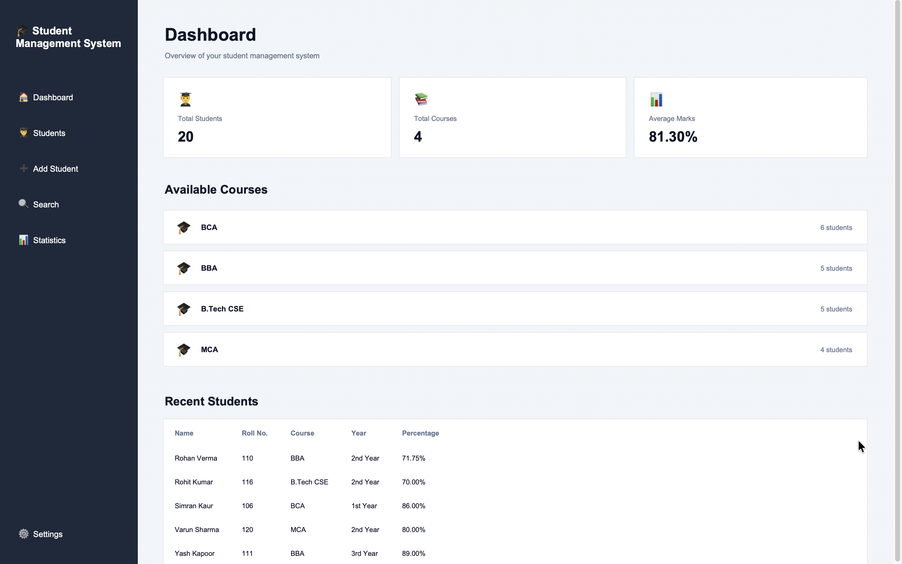
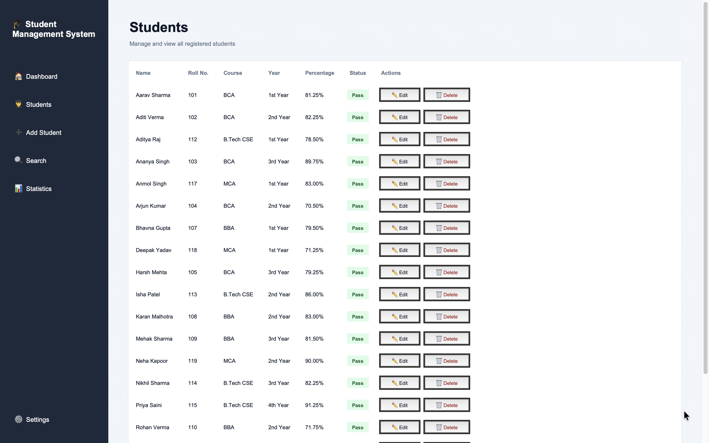
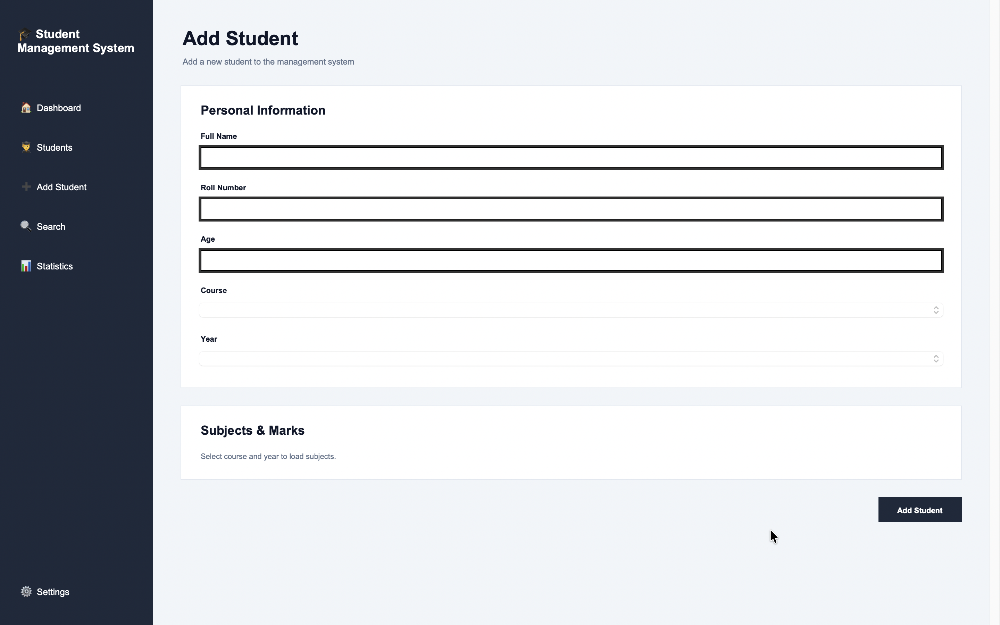
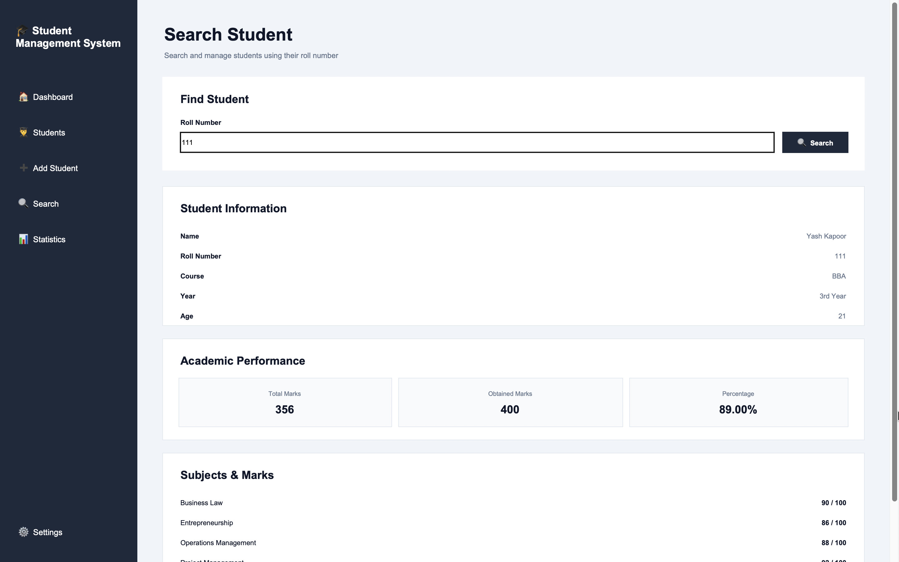
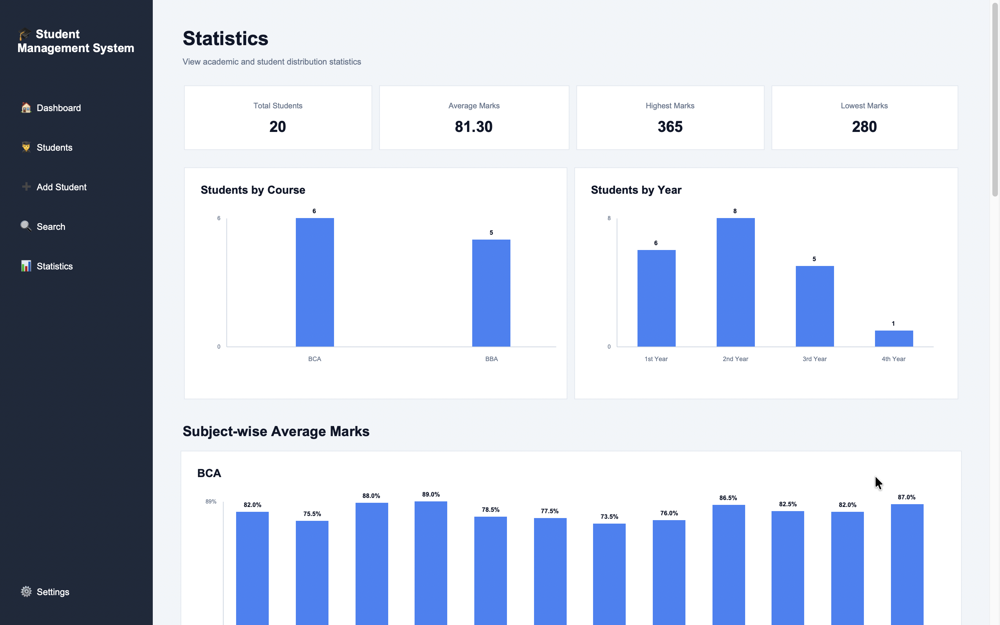
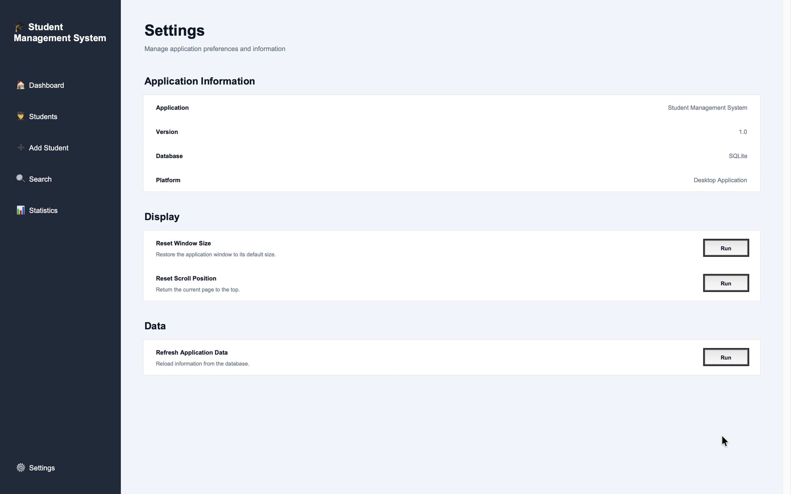

# Student Management System

A desktop-based **Student Management System** built with **Python, Tkinter, and SQLite**.

The application provides a clean graphical interface for managing student records, marks, courses, and academic statistics through a local SQLite database.

## ✨ Features

* 👨‍🎓 Add new students
* 📋 View all students
* 🔎 Search students by roll number
* ✏️ Edit student information
* 🗑️ Delete student records
* 📚 Course and year-based subject selection
* 📝 Add and manage subject marks
* 📊 Calculate total marks and percentage
* ✅ Display individual student Pass/Fail status
* 📈 Overall student statistics
* 📊 Course-wise student statistics
* 📅 Year-wise student statistics
* 📚 Subject-wise average marks
* 🏆 Top-performing students
* ✅ Pass/Fail statistics
* 📉 Visual statistics charts using Tkinter Canvas
* ⚙️ Settings page
* 🗄️ SQLite database for persistent data storage
* ✔️ Input validation for student data and marks

## 🛠️ Technologies Used

* **Python**
* **Tkinter** — Graphical User Interface
* **SQLite** — Database management
* **Git & GitHub** — Version control
* **Modular Python structure**

## 📚 Supported Courses

The current system includes:

* BCA
* BBA
* B.Tech CSE
* MCA

Subjects are automatically loaded according to the selected course and academic year.

## 🖥️ Application Pages

### Dashboard

The main dashboard provides an overview of the student management system and navigation to different sections.

### Students

Displays all registered students with:

* Name
* Roll Number
* Course
* Year
* Percentage
* Pass/Fail Status
* Edit/Delete actions

### Add Student

Allows users to add a new student with:

* Personal information
* Course
* Academic year
* Subject marks

The available subjects change dynamically according to the selected course and year.

### Search

Students can be searched using their roll number.

### Edit Student

Existing student information and marks can be updated while keeping the roll number protected from accidental modification.

### Statistics

The statistics dashboard provides academic insights such as:

* Total students
* Average marks
* Highest marks
* Lowest marks
* Course-wise student distribution
* Year-wise student distribution
* Subject-wise average marks
* Top-performing students
* Pass/Fail statistics

Visual charts are created using the built-in Tkinter Canvas functionality.

### Settings

Provides the application's settings section and interface information.

## 📸 Screenshots

### Dashboard


### Students


### Add Student


### Search


### Statistics


### Settings


## 🗄️ Database

The application uses **SQLite** for persistent storage.

The database contains separate structures for:

* Student information
* Student subject marks

Student marks are connected to their respective student records using database relationships.

The local database file is:

```text
students.db
```

## 📁 Project Structure

```text
StudentManagementSystem/
│
├── gui/
│   ├── __init__.py
│   ├── dashboard.py
│   ├── dashboard_page.py
│   ├── students_page.py
│   ├── add_student_page.py
│   ├── search_page.py
│   ├── edit_student_page.py
│   ├── statistics_page.py
│   └── settings_page.py
│
├── screenshots/
│   ├── dashboard.png
│   ├── students.png
│   ├── add-student.png
│   ├── search.png
│   ├── statistics.png
│   └── settings.png
│
├── courses.py
├── database.py
├── statistics.py
├── validation.py
├── main.py
├── .gitignore
└── README.md
```

## ▶️ How to Run

### 1. Clone the repository

```bash
git clone https://github.com/Taranbeer-singh/StudentManagementSystem.git
```

### 2. Open the project directory

```bash
cd StudentManagementSystem
```

### 3. Run the application

```bash
python3 main.py
```

The application will open in a desktop window.

## ✅ Validation

The system includes input validation to help prevent invalid student records.

Validation is applied to important fields such as:

* Student name
* Roll number
* Age
* Course
* Academic year
* Subject marks

## 📊 Statistics

The statistics system calculates academic information from the students stored in the SQLite database.

It includes:

* Overall performance
* Course distribution
* Year distribution
* Subject averages
* Student percentages
* Top-performing students
* Pass/Fail analysis

The statistics are calculated dynamically from the stored student records.

## 🎯 Project Goals

This project was developed to practice and demonstrate practical Python application development concepts including:

* Python programming
* Modular application design
* GUI development
* SQLite database integration
* CRUD operations
* Input validation
* Data processing
* Statistics and analysis
* Version control with Git

## 🔮 Future Improvements

Possible future improvements include:

* Export student records to CSV/Excel
* PDF report generation
* User authentication
* Advanced filtering and sorting
* Attendance management
* More advanced data visualization
* Backup and restore functionality

## 👨‍💻 Author

**Taranbeer Singh**

BCA Graduate | Python & Data Science Enthusiast

GitHub: [Taranbeer-singh](https://github.com/Taranbeer-singh)

---

⭐ If you find this project useful, feel free to explore the repository.
